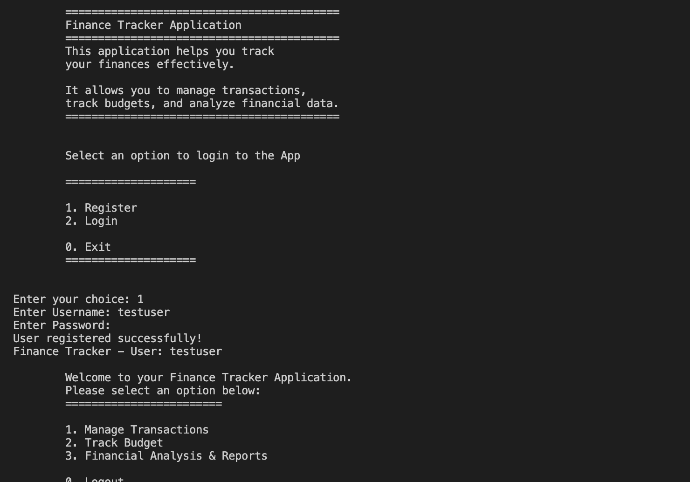
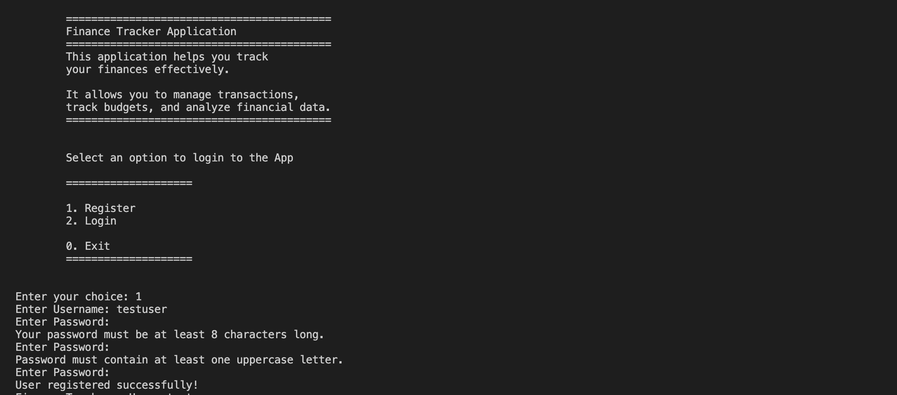
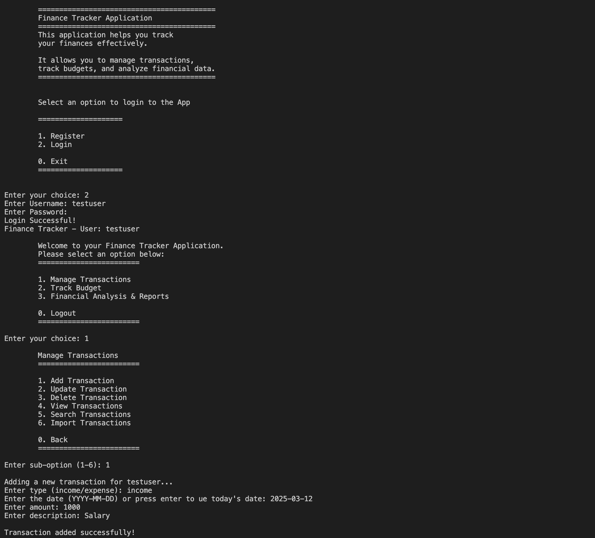
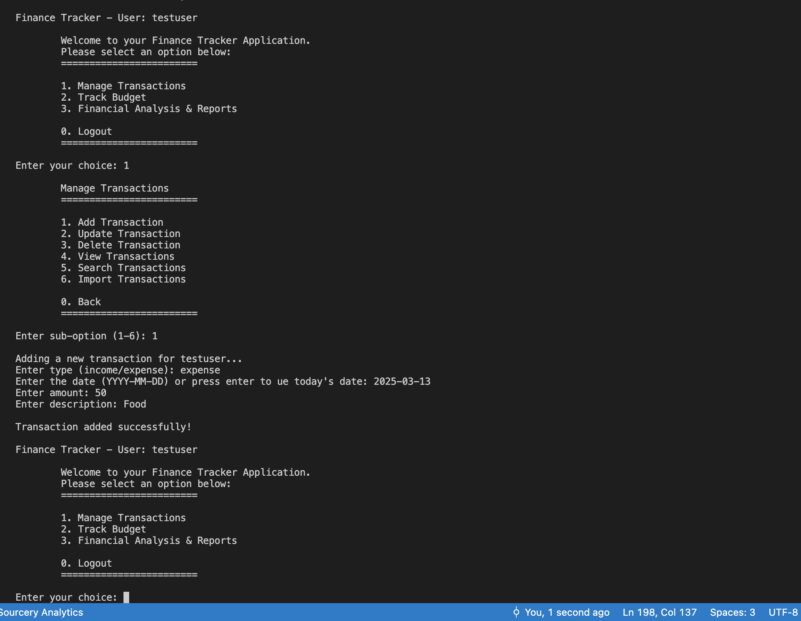
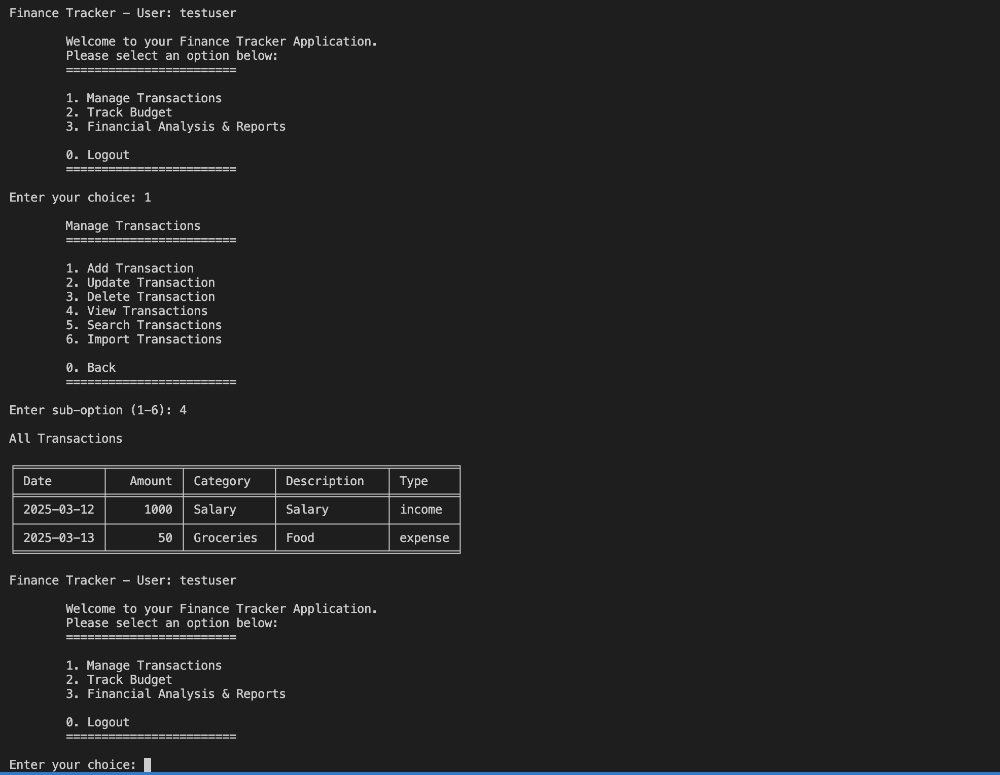
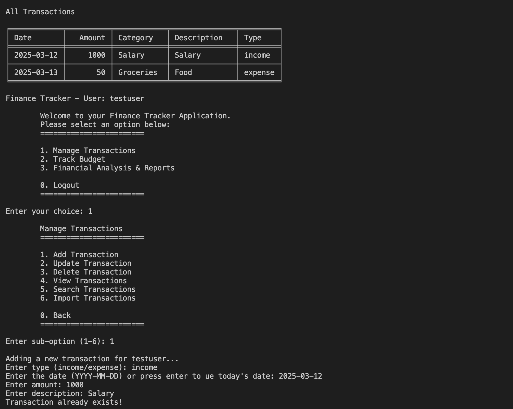
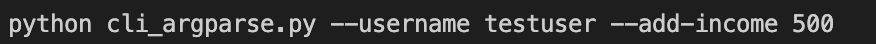
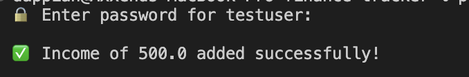
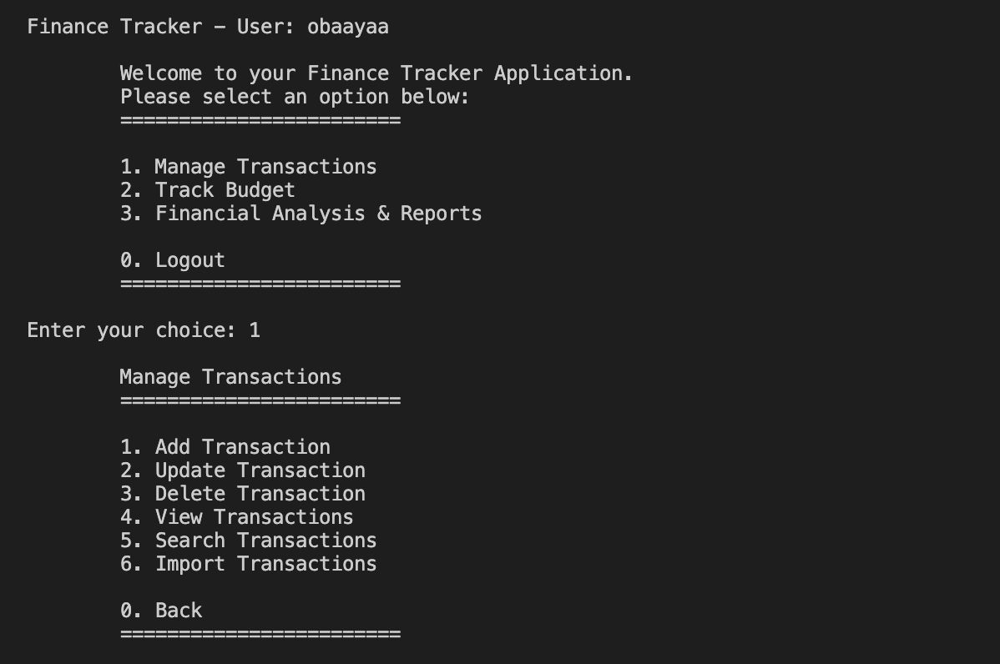
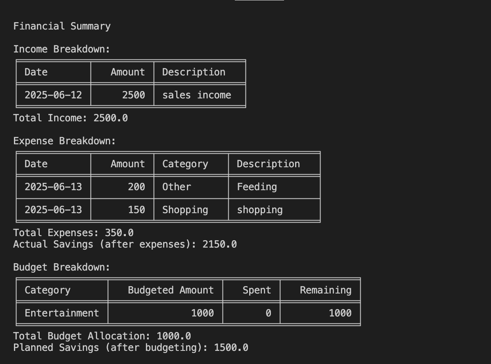

# Finance Tracker Application
 
A comprehensive personal finance management tool built in Python that helps users track income, expenses, manage budgets, and generate financial reports.
 
## Table of Contents
 
- [Features](#features)
- [Installation](#installation)
- [Requirements](#requirements)
- [Usage](#usage)
- [Testing](#testing)
- [Deployment](#deployment)
- [Running the application Locally with ttyd (for Testing)](#locally-running-the-application-using-ttyd)
- [Library Rationale](#library-rationale)
- [File Structure](#file-structure)
- [Security Features](#security-features)
- [Screenshots](#screenshots)
- [Contributing](#contributing)
- [Credits](#credits)
 
## Features
 
### **User Authentication**
 
- Secure login and registration
- Password reset functionality with security questions
- Password validation:
  - Minimum **8 characters**
  - At least **one uppercase letter**
  - At least **one lowercase letter**
  - At least **one number**
- Login attempts limited to prevent brute-force attacks
- General error message for invalid credentials to avoid exposing user existence
 
### **Transaction Management**
 
- Add, view, update, and delete transactions
- Delete multiple transactions at once
- **Prevent duplicate transactions**
- Categorize expenses automatically using NLP
- Search transactions by **date, category, or description**
- Import/export transactions from **CSV or JSON files**
- **Command-line support** for quick transaction entry
 
### **Budget Tracking**
 
- Set budgets for different spending categories
- Real-time budget alerts when exceeding limits
- View remaining budget for each category
 
### **Financial Analysis**
 
- View **financial summaries and reports**
- Track **spending by category**
- Export financial data to **CSV or JSON**
- Exported reports are saved in a **dedicated `financial_summary/` folder**
 
### **Command Line Interface**
 
- Add transactions **directly from the terminal**
- Import/export transactions via CLI
- Supports quick financial tracking **without navigating the menu**
- **Prevents duplicate transactions when adding via CLI**
 
## Installation
 
### Prerequisites
 
- Python 3.7 or higher
- pip (Python package installer)
- Git (for cloning repository)
 
### Step-by-Step Installation
 
1. **Clone the repository:**
 
   ```bash
   git clone https://github.com/yourusername/finance-tracker.git
   cd finance-tracker
   ```
 
2. **Create and activate a virtual environment:**
 
   **For Windows:**
 
   ```bash
   python -m venv finance_env
   finance_env\Scripts\activate
   ```
 
   **For macOS/Linux:**
 
   ```bash
   python3 -m venv finance_env
   source finance_env/bin/activate
   ```
 
3. **Install required dependencies:**
 
   ```bash
   pip install -r requirements.txt
   ```
 
4. **Download NLTK data (required for auto-categorization):**
 
   ```bash
   python -c "import nltk; nltk.download('punkt'); nltk.download('wordnet'); nltk.download('omw-1.4')"
   ```
 
5. **Verify installation:**
   ```bash
   python main.py
   ```
 
## Requirements
 
### System Requirements
 
- **Operating System:** Windows 10+, macOS 10.14+, or Linux (Ubuntu 18.04+)
- **Python Version:** 3.7 or higher
- **Memory:** Minimum 512MB RAM
- **Storage:** 100MB free disk space
 
### Python Dependencies
 
```
bcrypt==4.3.0
pandas==2.2.3
nltk==3.9.1
tabulate==0.9.0
colorama==0.4.6
```
 
## Usage
 
### **Interactive Mode**
 
```bash
python main.py
```
 
### **Command Line Interface**
 
```bash
# Add income
python cli_argparse.py --username Isaac --add-income 1000 --category "Salary"
 
# Add expense
python cli_argparse.py --username Isaac --add-expense 50 --category "Food"
 
# Export data
python cli_argparse.py --username Isaac --export summary.csv
 
# Import data
python cli_argparse.py --username Isaac --inport transactions.json
```
 
## Testing
 
### Testing Objectives
 
- Verify all application features work as intended
- Ensure data integrity and security
- Validate user interface functionality
- Confirm error handling works properly
- Test CLI and argparse module thoroughly
 
### Testing Scope
 
- **Functional Testing:** All user-facing features
- **Security Testing:** Authentication and data protection
- **Performance Testing:** Response times and data handling
- **Usability Testing:** User experience and interface
- **Integration Testing:** Module interactions
 
### Testing Environment
 
- **Operating Systems:** macOS Sonoma 14.6.1
- **Python Versions:** 3.13.3
- **Test Data:** Sample Transactions located in the test_file directory
 
### Manual Testing Procedures
 
#### Test Case 1: User Registration
 
**Objective:** Verify user registration functionality
**Steps:**
 
1. Run `python main.py`

2. Select option "1" (Register)
3. Enter username: "testuser"
4. Enter password: "TestPass123"
   **Expected Result:** User registered successfully
   **Actual Result:** ✅ Pass - User registered successfully
 

 
#### Test Case 2: Password Validation
 
**Objective:** Verify password strength requirements - This test case verifies the strength of the password in the registration process.
**Test Data:**
| Test Case || Password | Expected | Actual | Status |
|-----------||----------|----------|--------|--------|
| TC002a    || weak     | ❌ Reject | ❌ Reject | ✅ Pass |
| TC002b    || password123 | ❌ Reject | ❌ Reject | ✅ Pass |
| TC002c    || Password123 | ✅ Accept | ✅ Accept | ✅ Pass |
 
**Expected Results:**
- **TC002a:** Error message: "Your password must be at least 8 characters long."
- **TC002b:** Error message: "Password must contain at least one uppercase letter"
- **TC002c:** User registered successfully!
 

 
 
#### Test Case 3: Transaction Management
 
**Objective:** Test adding and viewing transactions
**Steps:**
 
1. Login as registered user
2. Select "Manage Transactions"
3. Click on "Add Transaction"
4. Enter "income" and enter date (YYYY-MM-DD) for transaction
5. Enter amount: 1000 and description: "Salary"
6. Select "Manage Transactions"
7. Click on "Add Transaction"
8. Enter "expense" and enter date (YYYY-MM-DD) for transaction
9. Enter amount: 500 and description: "Food"
10. Select "Manage Transactions"
11. Select View transactions
   **Expected Result:** Both transactions (Income and Expense) visible in list
   **Actual Result:** ✅ Pass - Transactions displayed correctly
 



 
#### Test Case 4: Duplicate Prevention
 
**Objective:** Verify duplicate transaction prevention
**Steps:**
 
1. Login as registered user
2. Select "Manage Transactions"
3. Click on "Add Transaction"
4. Enter "income" and enter date (2025-03-12) for transaction
5. Enter amount: 1000 and description: "Salary"
   **Expected Result:** System should reject duplicate by displaying "Transaction already exists"
   **Actual Result:** ✅ Pass - Duplicate rejected with message "Transaction already exists"
 

 
#### Test Case 5: CLI Operations
 
**Objective:** Test command-line interface
**Steps:**
1. Run command `python cli_argparse.py --username testuser --add-income 500`

2. Enter Password of user (testuser)
**Expected Result:** See a display of "Income of 500.0 added successfully!"
**Actual Result:** ✅ Pass - CLI operation successful with a message of "Income of 500.0 added successfully!"
 

 
### Bug Fixes Implemented
 
#### Bug #1: Import Function Error
 
**Issue:** `--import` argument caused syntax error
**Root Cause:** `import` is a Python reserved keyword
**Solution:** Changed argument to `--inport` in cli_argparse.py
**Testing:** Verified import functionality works with new argument
**Status:** ✅ Fixed
 
#### Bug #2: Duplicate Transactions
 
**Issue:** System allowed identical transactions
**Root Cause:** No duplicate checking mechanism
**Solution:** Implemented transaction comparison in finance.py
**Testing:** Attempted to add duplicate - system correctly rejected
**Status:** ✅ Fixed
 
#### Bug #3: Password Validation Bypass
 
**Issue:** Weak passwords were accepted
**Root Cause:** Incomplete validation regex
**Solution:** Enhanced password validation in auth.py
**Testing:** Tested various password combinations
**Status:** ✅ Fixed
 
## Deployment
 
This application was deployed in Heroku (as a command-line web app using ttyd) and below are the steps required to deploy this project to Heroku.
 
---
### Heroku Deployment (CLI App via ttyd)
 
This project was deployed to **Heroku** and accessed via a browser-based terminal using `ttyd`.
 
#### Step-by-step Instructions
 
1. **Create an `Aptfile`** in the project root with:
 
   ```
   ttyd
   ```
 
2. **Create a `Procfile`** in the project root with:
 
   ```
   web: ttyd -p $PORT --writable python3 main.py
   ```
 
3. **Add Heroku Buildpacks:**
 
   ```bash
   heroku buildpacks:add heroku/python
   heroku buildpacks:add https://github.com/heroku/heroku-buildpack-apt
   ```
 
4. **Initialize Git and Push to Heroku:**
 
   ```bash
   git init
   git add .
   git commit -m "Deploying application to Heroku"
   heroku create
   git push heroku main  # or master if using that branch
   ```
 
> 💡 You will now be able to run the CLI app through a browser terminal provided by `ttyd`.
 
---
 
## Running the application Locally with ttyd (for Testing)
 
You can also use ttyd locally to test the CLI experience in a browser:
### Clone the repository
```bash
git clone https://github.com/peleisaac/finance-tracker.git
cd finance-tracker
```
 
### Create and activate a virtual environment
**For Windows:**
 
```bash
python -m venv finance_env
finance_env\Scripts\activate
```
 
**For macOS/Linux:**
 
```bash
python3 -m venv finance_env
source finance_env/bin/activate
```
 
### Install the required dependancies
```bash
   pip install -r requirements.txt
```
 
### Download NLTK data (required for auto-categorization):
 
```bash
python -c "import nltk; nltk.download('punkt'); nltk.download('wordnet'); nltk.download('omw-1.4')"
```
 
### Verify installation:
   ```bash
   python main.py
   ```
 
#### Install ttyd:
 
```bash
brew install ttyd  # For macOS
```
 
#### Run the app:
 
```bash
ttyd --writable python3 main.py
# or simply
ttyd python3 main.py
```
 
Then visit [http://localhost:7681](http://localhost:7681) in your browser to interact with the CLI.
 
## Library Rationale
 
### Core Libraries
 
#### **bcrypt (v4.3.0)**
 
- **Purpose:** Password hashing and security
- **Rationale:** Industry-standard for secure password storage. Provides salt generation and adaptive hashing to prevent rainbow table attacks.
- **Alternative Considered:** hashlib - Rejected due to lack of built-in salting
 
#### **pandas (v2.2.3)**
 
- **Purpose:** Data manipulation and CSV/JSON operations
- **Rationale:** Excellent for handling financial data, provides robust CSV import/export, data filtering, and aggregation capabilities essential for financial analysis.
- **Alternative Considered:** Native CSV module - Rejected due to limited data manipulation capabilities
 
#### **nltk (v3.9.1)**
 
- **Purpose:** Natural Language Processing for transaction categorization
- **Rationale:** Enables automatic categorization of transactions based on description text. WordNet lemmatizer improves categorization accuracy.
- **Alternative Considered:** spaCy - Rejected due to larger size and complexity for our use case
 
#### **tabulate (v0.9.0)**
 
- **Purpose:** Formatted table display
- **Rationale:** Provides clean, readable table output for financial reports and transaction listings. Supports multiple output formats.
- **Alternative Considered:** Manual formatting - Rejected due to maintenance complexity
 
#### **colorama (v0.4.6)**
 
- **Purpose:** Cross-platform colored terminal output
- **Rationale:** Enhances user experience with colored success/error messages. Works consistently across Windows, macOS, and Linux.
- **Alternative Considered:** ANSI codes - Rejected due to Windows compatibility issues
 
### Supporting Libraries
 
#### **numpy (v2.0.2)**
 
- **Purpose:** Mathematical operations (pandas dependency)
- **Rationale:** Required by pandas for numerical computations
 
#### **python-dateutil (v2.9.0.post0)**
 
- **Purpose:** Enhanced date parsing
- **Rationale:** Provides flexible date parsing for transaction imports
 
## File Structure
 
```
finance-tracker/
├── main.py                     # Main application entry point
├── auth.py                     # User authentication system
├── finance.py                  # Core finance tracking functionality
├── menu_display.py             # Menu system for the application
├── cli_argparse.py             # Command line interface functionality
├── requirements.txt            # Python dependencies
├── README.md                   # Project documentation
├── TESTING.md                  # Detailed testing documentation
├── transactions/               # User transaction data storage
│   └── {username}_transactions.json
├── test_file/                  # Test data files
│   └── test.csv
├── financial_summary/          # Exported financial reports
├── credentials.json            # User credentials (created at runtime)
└── screenshots/                # Application screenshots
    ├── main_menu.png
    ├── transaction_view.png
    └── financial_report.png
```
 
## Security Features
 
### Password Security
 
- **Hashing:** bcrypt with salt rounds
- **Validation:** 8+ characters, mixed case, numbers
- **Storage:** Hashed passwords only, never plain text
 
### Authentication
 
- **Login Attempts:** Limited to prevent brute force
- **Session Management:** Secure user session handling
- **Error Messages:** Generic messages to prevent user enumeration
 
## Screenshots
 
### Transaction Management
 

_Transaction listing with search and filter capabilities_
 
### Financial Reports
 

_Sample financial summary report with category breakdown_
 
## Contributing
 
1. Fork the repository
2. Create a feature branch (`git checkout -b feature/new-feature`)
3. Commit your changes (`git commit -am 'Add new feature'`)
4. Push to the branch (`git push origin feature/new-feature`)
5. Create a Pull Request
 
### Development Guidelines
 
- Follow PEP 8 style guidelines
- Add docstrings to all functions
- Include unit tests for new features
- Update documentation as needed
 
## Credits
 
**Developer:** Isaac Aboagye
**Course:** Portfolio project 3
**Institution:** Code Institute
**Year:** 2024
 
### Acknowledgments
 
- Python Software Foundation for Python
- NumFOCUS for pandas
- NLTK team for natural language processing tools
- bcrypt developers for security utilities
 
### Third-Party Assets
 
- Icons: None used
- Fonts: System default
- External APIs: None used
 
## Support
 
For support and questions:
 
- Email: peleisaac@gmail.com
- GitHub Issues: [https://github.com/peleisaac/finance-tracker.git]/issues
- Documentation: This README file
 
---
 
**Version:** 1.0.0  
**Last Updated:** December 2024  
**Tested On:** Python 3.13.3, macOS Sonoma 14.6.1
